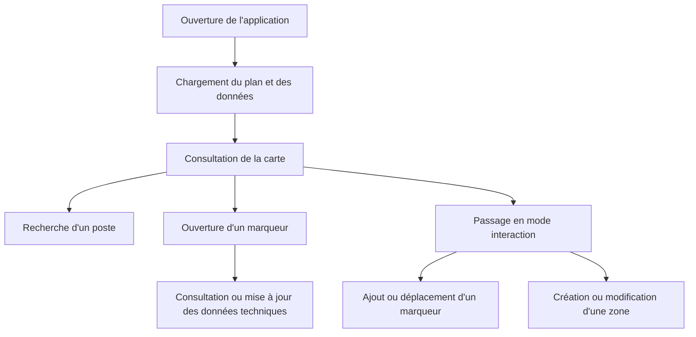

# Solution fonctionnelle

[Retour au sommaire](../projet-tutore-wiki.md)

## Principe
Le prototype affiche un plan du site dans une interface web, puis y superpose :
- des zones ;
- des marqueurs représentant les postes ;
- un panneau de consultation et d'édition.

**Références code :**
- [InfrastructureMap.tsx](../../frontend/src/features/infrastructure-map/InfrastructureMap.tsx)
- [LoadedInfrastructureMap.tsx](../../frontend/src/features/infrastructure-map/ui/LoadedInfrastructureMap.tsx)
- [InfrastructureMapCanvas.tsx](../../frontend/src/features/infrastructure-map/ui/InfrastructureMapCanvas.tsx)

## Fonctionnalités disponibles
- affichage du plan du site ;
- affichage des zones définies ;
- affichage des postes sous forme de marqueurs ;
- recherche locale d'un poste ;
- ajout d'un marqueur ;
- déplacement d'un marqueur ;
- suppression d'un marqueur ;
- création d'une zone par dessin ;
- choix d'un secteur existant ou saisie d'un nouveau secteur lors de la création d'une zone ;
- modification d'une zone ;
- redimensionnement d'une zone ;
- suppression d'une zone ;
- mise à jour de certains champs techniques.

## Parcours utilisateur

## Règles métier prises en compte
- Une zone possède un code unique.
- Une zone est rattachée à un secteur.
- Un équipement placé peut être rattaché à `0..1` zone.
- La compatibilité entre la localisation résolue d'un équipement et le secteur de la zone est contrôlée lors de certaines opérations.
- Certaines mises à jour de zone ou de secteur déclenchent une resynchronisation des données de localisation.

[Page précédente : Contexte et objectifs](./01-contexte-et-objectifs.md)  
[Page suivante : Architecture technique](./03-architecture-technique.md)
