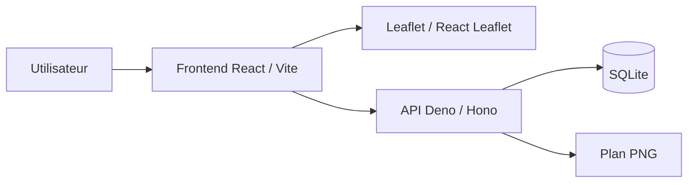
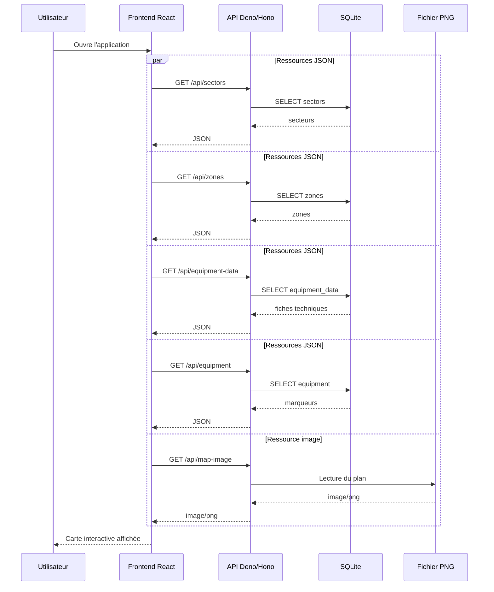

# Architecture technique

[Retour au sommaire](../projet-tutore-wiki.md)

## Stack utilisée

| Couche | Choix |
|---|---|
| Frontend | React + Vite + Tailwind CSS |
| Cartographie | Leaflet / React Leaflet |
| Backend | Deno + Hono |
| Persistance | SQLite |
| Ressource cartographique | Image PNG servie par l'API |

**Références code :**
- frontend : [frontend/package.json](../../frontend/package.json)
- backend : [backend/deno.json](../../backend/deno.json)
- base de données : [sqlite.ts](../../backend/src/db/sqlite.ts), [schema.sql](../../backend/db/schema.sql)

## Schéma d'architecture

**Références code :**
- [createApiApp.ts](../../backend/src/app/createApiApp.ts)
- [index.ts](../../backend/src/features/infrastructure-map/index.ts)
- [map-image/routes.ts](../../backend/src/features/infrastructure-map/map-image/routes.ts)
- [InfrastructureMapCanvas.tsx](../../frontend/src/features/infrastructure-map/ui/InfrastructureMapCanvas.tsx)

## Chargement initial
Dans l'implémentation actuelle, le frontend charge en parallèle :
- les secteurs ;
- les zones ;
- les fiches techniques ;
- les marqueurs déjà placés ;
- le plan du site et ses dimensions.

**Références code :**
- [useInfrastructureMapBootstrap.ts](../../frontend/src/features/infrastructure-map/model/useInfrastructureMapBootstrap.ts)
- [loadMapImageDimensions.ts](../../frontend/src/features/infrastructure-map/map-image/services/loadMapImageDimensions.ts)

## Séquence de chargement

## Routes principales

| Route | Méthode | Rôle | Fichier |
|---|---|---|---|
| `/api/sectors` | `GET`, `POST` | lister et créer les secteurs | [sectors/routes.ts](../../backend/src/features/infrastructure-map/sectors/routes.ts) |
| `/api/sectors/:sectorId` | `PATCH`, `DELETE` | modifier ou supprimer un secteur | [sectors/routes.ts](../../backend/src/features/infrastructure-map/sectors/routes.ts) |
| `/api/zones` | `GET`, `POST` | lister et créer les zones | [zones/routes.ts](../../backend/src/features/infrastructure-map/zones/routes.ts) |
| `/api/zones/:zoneId` | `PATCH`, `DELETE` | modifier ou supprimer une zone | [zones/routes.ts](../../backend/src/features/infrastructure-map/zones/routes.ts) |
| `/api/equipment-data` | `GET`, `POST` | lister et créer les fiches techniques | [equipment-data/routes.ts](../../backend/src/features/infrastructure-map/equipment-data/routes.ts) |
| `/api/equipment-data/:equipmentDataId` | `PATCH`, `DELETE` | modifier ou supprimer une fiche technique | [equipment-data/routes.ts](../../backend/src/features/infrastructure-map/equipment-data/routes.ts) |
| `/api/equipment` | `GET`, `POST` | lister et créer les marqueurs | [equipment/routes.ts](../../backend/src/features/infrastructure-map/equipment/routes.ts) |
| `/api/equipment/:equipmentRecordId` | `PATCH`, `DELETE` | modifier ou supprimer un marqueur | [equipment/routes.ts](../../backend/src/features/infrastructure-map/equipment/routes.ts) |
| `/api/map-image` | `GET` | récupérer le plan PNG | [map-image/routes.ts](../../backend/src/features/infrastructure-map/map-image/routes.ts) |

## Organisation générale du code
- Le frontend assemble les données et gère les interactions.
- Le backend expose une API REST légère.
- SQLite stocke les secteurs, les zones, les fiches techniques et les positions.
- Le plan est lu comme un fichier image via l'API.

**Références code :**
- frontend : [InfrastructureMap.tsx](../../frontend/src/features/infrastructure-map/InfrastructureMap.tsx), [LoadedInfrastructureMap.tsx](../../frontend/src/features/infrastructure-map/ui/LoadedInfrastructureMap.tsx)
- backend : [createApiApp.ts](../../backend/src/app/createApiApp.ts), [index.ts](../../backend/src/features/infrastructure-map/index.ts)
- persistance : [schema.sql](../../backend/db/schema.sql), [sqlite.ts](../../backend/src/db/sqlite.ts)

[Page précédente : Solution fonctionnelle](./02-solution-fonctionnelle.md)  
[Page suivante : Modèle de données et flux métier](./04-modele-de-donnees-et-flux.md)
