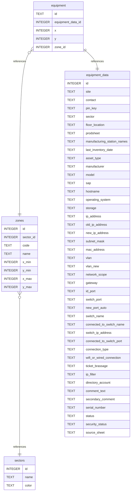
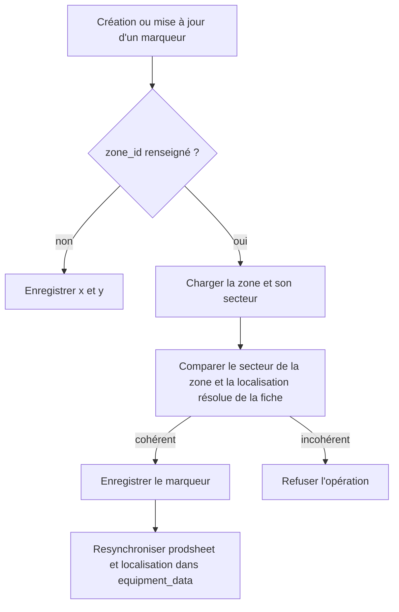
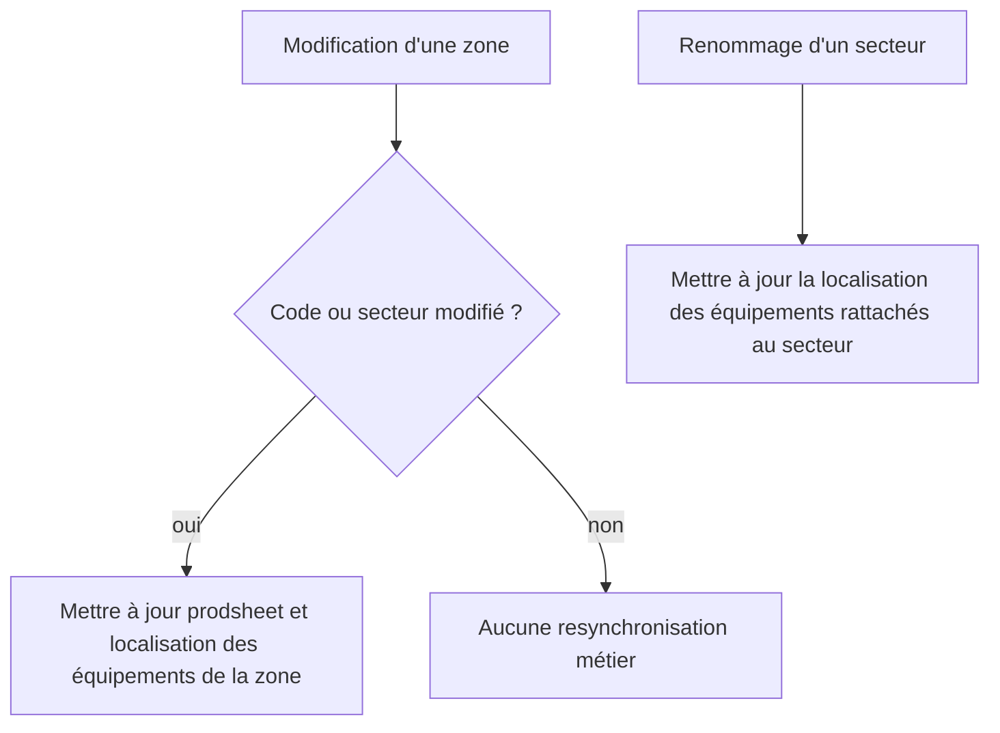

# Modèle de données et flux métier

[Retour au sommaire](../projet-tutore-wiki.md)

## Tables principales
- `sectors` : secteurs fonctionnels et leur couleur.
- `zones` : zones rectangulaires dessinées sur le plan.
- `equipment_data` : fiches techniques des postes.
- `equipment` : positions des postes sur le plan.

**Référence code :**
- [schema.sql](../../backend/db/schema.sql)

## Schéma relationnel

## Contraintes importantes
- `zones.code` est unique et doit respecter un format numérique à trois chiffres.
- Les bornes d'une zone doivent vérifier `x_min < x_max` et `y_min < y_max`.
- `equipment.zone_id` est nullable : une fiche peut exister sans être placée.
- `equipment.equipment_data_id` est unique : une fiche technique ne peut avoir qu'une seule position active.

**Références code :**
- [schema.sql](../../backend/db/schema.sql)
- [zones/validation.ts](../../backend/src/features/infrastructure-map/zones/validation.ts)

## Flux : création ou déplacement d'un marqueur

**Références code :**
- création et déplacement côté frontend : [useInfrastructureMapState.ts](../../frontend/src/features/infrastructure-map/state/useInfrastructureMapState.ts), [markerMovement.ts](../../frontend/src/features/infrastructure-map/markers/logic/interactive-markers/markerMovement.ts)
- contrôle de compatibilité et resynchronisation côté backend : [equipment/helpers.ts](../../backend/src/features/infrastructure-map/equipment/helpers.ts), [equipment/service.ts](../../backend/src/features/infrastructure-map/equipment/service.ts)

## Flux : mises à jour avec effet de bord

**Références code :**
- mise à jour de zone : [zones/service.ts](../../backend/src/features/infrastructure-map/zones/service.ts)
- mise à jour de secteur : [sectors/service.ts](../../backend/src/features/infrastructure-map/sectors/service.ts)
- resynchronisation locale des marqueurs lors d'une modification de zone : [infrastructureMapState.helpers.ts](../../frontend/src/features/infrastructure-map/state/infrastructureMapState.helpers.ts)

[Page précédente : Architecture technique](./03-architecture-technique.md)  
[Page suivante : Choix techniques et problèmes rencontrés](./05-choix-techniques-et-problemes-rencontres.md)
