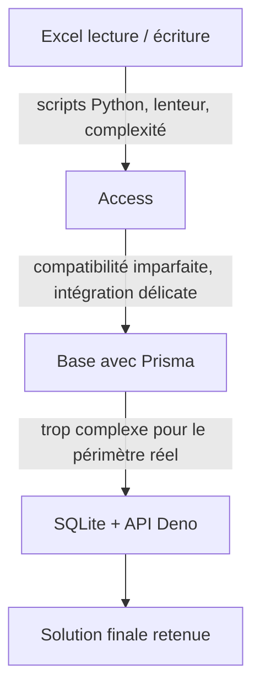

# Choix techniques et problèmes rencontrés

[Retour au sommaire](../projet-tutore-wiki.md)

## Logique générale
Le projet n'a pas été construit directement avec sa forme finale. Plusieurs choix ont été affinés au fur et à mesure pour rester cohérents avec :
- le besoin réel ;
- le temps disponible ;
- le niveau de complexité acceptable pour un prototype.

Cette page restitue le cheminement du projet et les arbitrages effectués pendant sa réalisation. Les éléments décrivant l'historique des solutions envisagées montre donc du déroulement du projet 

## 1. Choix d'une stack web légère
Le premier arbitrage a porté sur la stack globale.

Le choix s'est porté sur une application web légère, car elle permet :
- une interface visuelle adaptée au besoin ;
- une démonstration simple ;
- une séparation claire frontend / backend ;
- une complexité plus maîtrisée qu'une solution plus lourde.

## 2. Choix de Leaflet pour le plan
Leaflet a été retenu car il répond directement au besoin du prototype :
- afficher une image du site ;
- dessiner des zones ;
- placer et déplacer des marqueurs ;
- rester simple à mettre en place.

Dans ce projet, Leaflet est utilisé comme moteur de plan interactif, pas comme client de cartographie géographique.

**Références code :**
- [InfrastructureMapCanvas.tsx](../../frontend/src/features/infrastructure-map/ui/InfrastructureMapCanvas.tsx)
- [mapConfig.ts](../../frontend/src/features/infrastructure-map/shared/mapConfig.ts)
- [loadMapImageDimensions.ts](../../frontend/src/features/infrastructure-map/map-image/services/loadMapImageDimensions.ts)

## 3. Choix de Deno + Hono pour l'API
Le backend devait rester simple et cohérent avec TypeScript.

Le choix Deno + Hono apporte :
- une API REST légère ;
- une mise en place rapide ;
- une structure claire ;
- un accès simple à SQLite.

**Références code :**
- [createApiApp.ts](../../backend/src/app/createApiApp.ts)
- [index.ts](../../backend/src/features/infrastructure-map/index.ts)
- [backend/deno.json](../../backend/deno.json)
- [sqlite.ts](../../backend/src/db/sqlite.ts)

## 4. Problème du stockage
Le choix du stockage a évolué au cours du projet.

### Lecture de ce cheminement
- Excel était simple au départ, mais trop contraignant en lecture / écriture.
- Access apportait une structure, mais avec une compatibilité imparfaite.
- Prisma apportait du cadre, mais une complexité jugée excessive pour le projet.
- SQLite a été retenu comme meilleur compromis entre simplicité, fiabilité et suffisance.

**Références code pour l'état final retenu :**
- [schema.sql](../../backend/db/schema.sql)
- [sqlite.ts](../../backend/src/db/sqlite.ts)
- [equipmentDataRepository.ts](../../backend/src/db/repositories/equipmentDataRepository.ts)

## 5. Problème du placement des postes
Le placement des postes a demandé un vrai apprentissage :
- récupération des coordonnées ;
- conservation des positions ;
- rattachement à une zone ;
- maintien de la cohérence lors des déplacements.

**Références code :**
- [InfrastructureMapCanvas.tsx](../../frontend/src/features/infrastructure-map/ui/InfrastructureMapCanvas.tsx)
- [mapGeometry.ts](../../frontend/src/features/infrastructure-map/shared/mapGeometry.ts)
- [markerBounds.ts](../../frontend/src/features/infrastructure-map/markers/logic/interactive-markers/markerBounds.ts)
- [markerMovement.ts](../../frontend/src/features/infrastructure-map/markers/logic/interactive-markers/markerMovement.ts)

## 6. Problème de cohérence métier
Le projet a aussi nécessité des contrôles de cohérence pour éviter :
- un poste placé dans une zone incohérente ;
- une zone modifiée sans mise à jour des données associées ;
- une divergence entre position sur le plan et informations techniques.

**Références code :**
- [equipment/helpers.ts](../../backend/src/features/infrastructure-map/equipment/helpers.ts)
- [zones/service.ts](../../backend/src/features/infrastructure-map/zones/service.ts)
- [sectors/service.ts](../../backend/src/features/infrastructure-map/sectors/service.ts)
- [pcTechnicalDetails.ts](../../frontend/src/features/infrastructure-map/pc-details/logic/pcTechnicalDetails.ts)

## 7. Problème de données hétérogènes
Les données techniques ne sont pas toujours homogènes selon leur origine.

Le prototype a donc dû gérer :
- des champs parfois redondants ;
- une logique de résolution pour certaines valeurs affichées ;
- une recherche multi-critères côté frontend.

**Références code :**
- [aliases.ts](../../backend/src/features/infrastructure-map/equipment-data/aliases.ts)
- [MapSearchPanel.tsx](../../frontend/src/features/infrastructure-map/markers/ui/MapSearchPanel.tsx)
- [fields.ts](../../frontend/src/features/infrastructure-map/markers/logic/marker-search/fields.ts)

[Page précédente : Modèle de données et flux métier](./04-modele-de-donnees-et-flux.md)  
[Page suivante : Limites, perspectives et bilan](./06-limites-perspectives-et-bilan.md)
